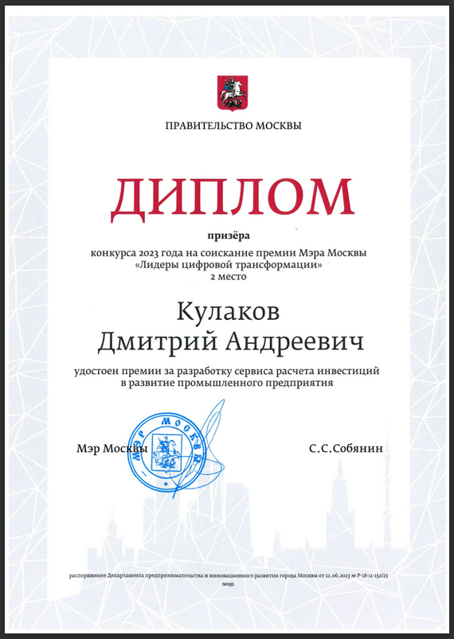
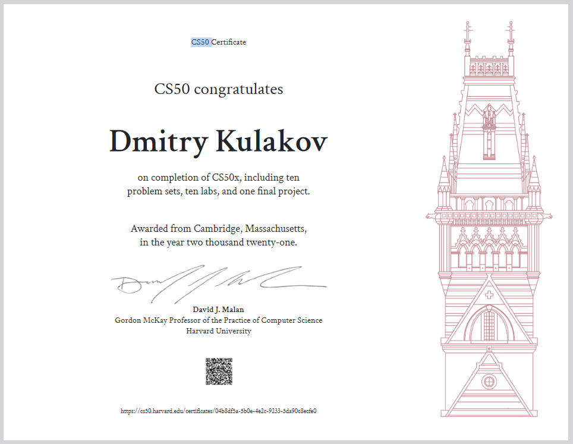

 

  

    <a href="https://dmitrykulakov.vercel.app/"><strong>Portfolio</strong></a>
    ·
    <a href="https://www.linkedin.com/in/dmitrykulakovfrontend/"><strong>Linkedin</strong></a>
    ·
    <a href="https://twitter.com/AtomEistee"><strong>Twitter</strong></a>
    ·
    <a href="https://drive.google.com/file/d/1Y8oBnZOAU0qBaXed5PAhMu_6ff4xMHFV/view?usp=sharing"><strong>Resume</strong></a>
  

 

Hi there! I'm Dmitry Kulakov, a software engineer with a focus on front-end development. I enjoy working with people and creating web applications. My passion for coding allows me to turn ideas into tangible and user-friendly experiences for users to enjoy.In my spare time, I love to stay up-to-date on the latest developments in the tech industry and explore new technologies to improve my skillset.

Want to know more about me? [Portfolio.](https://dmitrykulakov.vercel.app/)

 

## 💼 Skills

More Skills

 

 

<h1 align="center" style="padding-top:64px">Personal Projects</h1>
<table bordercolor="#66b2b2">
    <tr>
    <td valign="top">
      <h3 align="center">Paladins Data</h3>
        <a target="_blank" href="https://paladins-data.vercel.app/">
          

            
          

        </a>
        

    
  
      

        
<strong>React, GraphQL, SCSS, Node.js, MongoDB, & Express.js</strong> - Web application that uses Hi-Rez Studios API to show user statistics from the game "Paladins"

         
    </td>
  </tr>
    <tr>
    <td>
      <h3 align="center">Interview PlayBook</h3>
        <a target="_blank" href="https://interviewplaybook.vercel.app/">
          

            
          

        </a>
         
        

    
  
      

        
<strong>Next.js, MongoDB, TypeScript, Tailwind, tRPC & Prisma</strong> - Full-stack application to improve answers in interviews by completing quizzes, leaving comments to help others and liking the best quizzes!

    </td>
  </tr>
</table>
<!-- OPEN SOURCE CONTRIBUTION -->
<h1 align="center" style="padding-top:64px">Open Source Contributions</h1>
<table bordercolor="#66b2b2">
  <tr>
    <td width="50%" valign="top">
      <h3 align="center">Biodrop</h3>
         
        <a target="_blank" href="https://www.biodrop.io/">
        

            
        

        </a>
         
        

          
    
  
     
     
      

        
Open source contributor to Biodrop an open-source project to connect users to their audience with a single link
showcasing the content they create and their projects in one place.

        

          <h3>What I've worked on:</h3>
          
Implemented new features

          
Refactored authorization process

          
Created new tests

        

    </td>
  </tr>
</table>

<!-- Certificates -->

<h1 align="center" style="padding-top:64px">Certificates</h1>
<table bordercolor="#66b2b2">
  <tr>
   <td >
      <h3 align="center">2nd place in biggest Russian hackathon "Leaders of Digital Transformations"</h3>
         
        <a target="_blank" href="https://drive.google.com/file/d/18KHulWGIMLSOEuaTeVlR-tEOBcPHYWUR/view?usp=sharing">
        

            
        

        </a>
     
Our team secured 2nd place in a highly competitive competition with 7,000+ participants and a $500,000 prize budget. We developed an advanced service for calculating investments in
industrial enterprise development. Utilizing machine learning algorithms, our data scientists improved salary calculations by up to 20%. Our dedicated team of backend and frontend
developers, data scientists, and a designer committed 6+ hours daily to coding and meeting milestones. We were recognized as finalists among 210 participants teams in our topic.

    </td>
  </tr>
  <tr>
   <td >
      <h3 align="center">CS50x Harvard course</h3>
         
        <a target="_blank" href="https://drive.google.com/file/d/18KHulWGIMLSOEuaTeVlR-tEOBcPHYWUR/view?usp=sharing">
        

            
        

        </a>
     
Completed full course of computer science which includes ten problem sets, ten labs and a final project

        

          <h3>Gained knowledge:</h3>
          
Computer science
concepts: algorithms, data structures, and
complexity analysis.

          
Basic Proficiency in C and Python

          
Better understanding of programming paradigms

        

    </td>
  </tr>
</table>

 
 

<h2 align="center"> &#x1f4c8; Stats </h2>

 

<!-- daily.dev card 

 -->

  

  

 

 
