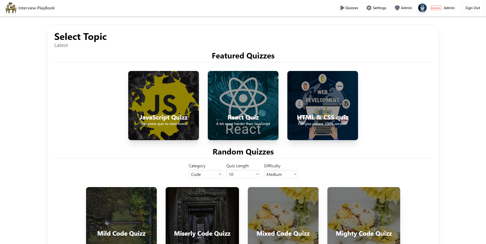
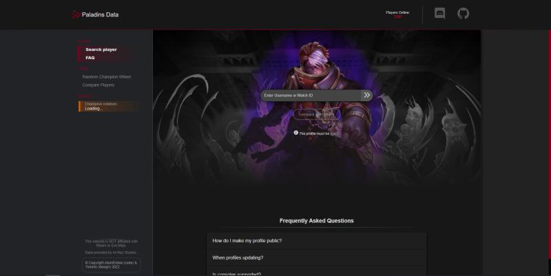
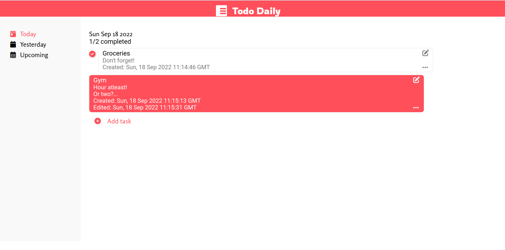

Hi there! I'm Dmitry Kulakov, a software engineer with a focus on front-end development. I enjoy working with people and creating web applications. My passion for coding allows me to turn ideas into tangible and user-friendly experiences for users to enjoy.In my spare time, I love to stay up-to-date on the latest developments in the tech industry and explore new technologies to improve my skillset.

Want to know more about me? [Here my portfolio.](https://dmitrykulakov.vercel.app/)

 

## 💼 Skills

More Skills

 

 

<h1 align="center">Projects</h1>
<table bordercolor="#6c25be">
  
  
  <tr>
    <td>
      <h3 align="center">Books Hut</h3>
         
        
         
        

    
  
      

        
<strong>Redis, PostgreSQL, React, Node.js & TypeScript</strong> - Website library with the ability to create an account and access a wide range of books

    </td>
    <td>
      <h3 align="center">Interview PlayBook</h3>
         
        
         
        

    
  
      

        
<strong>Next.js, TypeScript, Tailwind, tRPC & Prisma</strong> - Full-stack application to improve answers in interviews by completing quizzes!

    </td>
  </tr>
  <tr>
    <td width="50%" valign="top">
      <h3 align="center">Paladins Data</h3>
         
        
         
        

    
  
      

        
<strong>React, GraphQL, SCSS, Node.js, MongoDB, & Express.js</strong> - Web application that uses Hi-Rez Studios API to show user statistics in the game "Paladins"

    </td>
    <td width="50%" valign="top"><h3 align="center">Todo Daily</h3>
         
        
         
        

    
  
      

        
<strong>JavaScript, CSS, HTML</strong> - To-do app with all CRUD functionality and ability to write tasks for a week forward or backward.

    </td>
  </tr>
</table>

 
 

<h2 align="center"> &#x1f4c8; Stats </h2>

 

<!-- daily.dev card 

 -->

  

  

 

 
